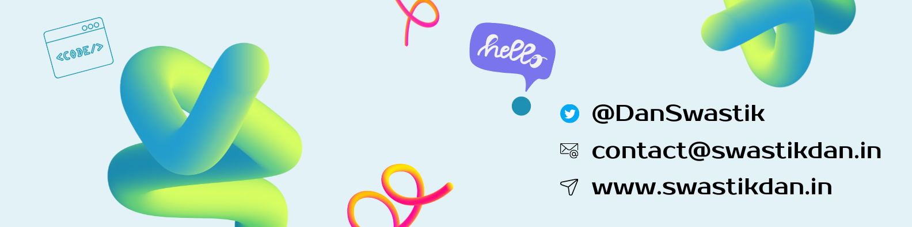

<style>
@import url('https://fonts.googleapis.com/css2?family=Fira+Sans:ital,wght@0,100;0,200;0,300;0,400;0,500;0,600;0,700;0,800;0,900;1,100;1,200;1,300;1,400;1,500;1,600;1,700;1,800;1,900&display=swap');


.body {
  font-family: 'Fira Sans', sans-serif;
  font-size: 16px;
  line-height: 1.6;
  font-weight: 400;
  font-style: normal;
  margin: 0;
  padding: 0;
}
.image {
  width: 100%;
  height: auto;
  border-radius: 10px;
/*  gray box shadow  */
  box-shadow: 0 4px 6px 0 rgba(0, 0, 0, 0.1), 0 2px 4px 0 rgba(0, 0, 0, 0.08);

  margin: 0;
  margin-bottom: 20px;
  border-width: 2px;
  border-color: rgb(148 163 184);


}

.padding-div{
  height: 10px;
}

</style>

<div class='body'>



<!-- Introduction -->

```JavaScript
 💫 About Me:
```

- 🙋‍♂️ Hi 👋, I'm Swastik Dan
- 🚀 A passionate Full Stack developer
- 🔭 I’m currently working on [**`Film Fanatic`**](https://github.com/Swastikdan/Film-Fanatic)

- 🌱 I’m currently learning **`React` `Astro` `Next Js`**
- 📫 How to reach me: **`contact@swastikdan.in`**

<div class='padding-div'>

</div>

```JavaScript
  🌐 Socials:
```

<div class='padding-div'>

</div>

[ **`Linkdin`** ](https://linkedin.com/in/swastikdan/) [ **`Portfolio`** ](https://www.swastikdan.in/)

<div class='padding-div'>

</div>

```JavaScript
  💻 Tech Stack:
```

<div class='padding-div'>

</div>

**Language** : **`JavaScript` `Java`**

**Frontend**: **`React` `HTML` `CSS` `Tailwind` `Next Js` `Astro`**

**Backend**: **`Express` `MongoDB` `Mongoose` `SQL`**

</div>
